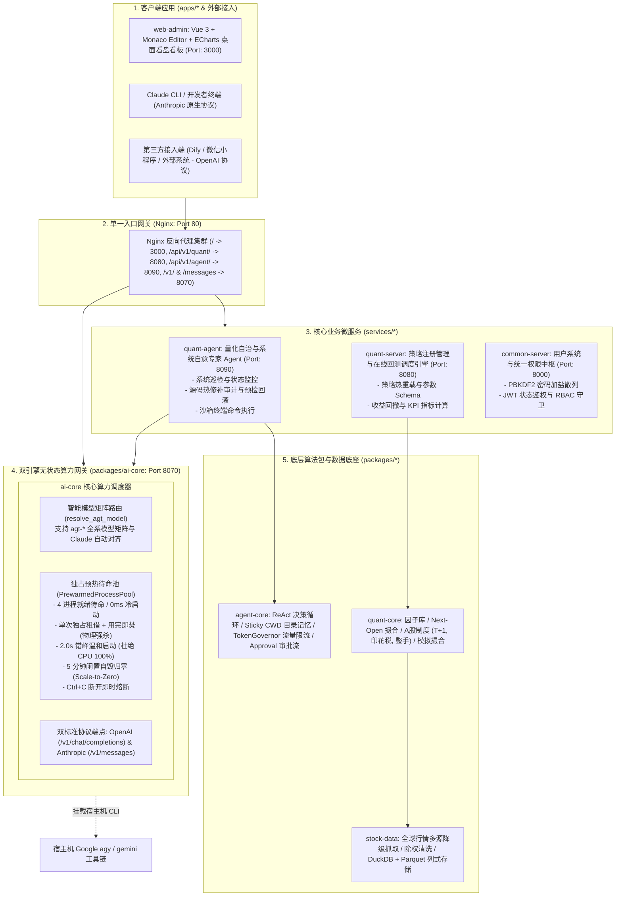

# Global Quant System (全栈量化工程与自主智能体 Monorepo)

基于现代工具链打造的 **Polyglot Monorepo（多语言统一工作区）** 全栈量化投研、自主智能体与执行系统。  
系统涵盖：**全球数据中台 (`stock-data`)**、**量化投研内核 (`quant-core`)**、**自主智能体 SDK (`agent-core`)**、**双引擎算力网关 (`ai-core`)**、**业务微服务集群 (`services/*`)** 以及 **深色拟态看盘与策略工作台 (`web-admin`)**。

---

## 一、 系统架构拓扑图



---

## 二、 模块结构清单

| 顶层分类 | 模块路径 | 技术栈 | 核心定位与职责 |
| :--- | :--- | :--- | :--- |
| **客户端终端 (`apps/`)** | **`apps/web-admin`** | Vue 3 / Vite / TypeScript / ECharts | 桌面端深色拟态量化工作台：内置 Monaco 代码编辑器、策略热编写与智能补全、回测收益曲线绘制、Agent 对话与审批交互。 |
| **业务微服务 (`services/`)** | **`services/quant-agent`** | Python / FastAPI / SSE | **量化自治与自愈专家 Agent**：内置 Dynamic Tool Registry，具备系统巡检、安全源码修补审计（自动备份与预检回滚）、终端沙箱执行能力。 |
| **业务微服务 (`services/`)** | **`services/quant-server`** | Python / FastAPI / Uvicorn | **量化计算与调度中枢**：对外暴露策略注册、参数 Schema 元数据探测、在线回测任务执行与 KPI 报表。 |
| **业务微服务 (`services/`)** | **`services/common-server`** | Python / FastAPI / SQLAlchemy / SQLite | **通用微服务中枢**：负责用户中心、密码加盐加密、JWT 鉴权、RBAC 权限守卫。 |
| **算力微服务 (`packages/`)** | **`packages/ai-core`** | Python / FastAPI / Asyncio | **双引擎无状态算力网关**：原生支持 OpenAI + Anthropic 双协议，内置 4 进程独占预热待命池（用完即焚、零冷启动、2s 错峰启动、5min Scale-to-Zero、Ctrl+C 熔断），全系 `agt-*` 模型矩阵路由。 |
| **底层核心包 (`packages/`)** | **`packages/agent-core`** | Python / Pydantic / Asyncio | **自主智能体 SDK**：ReAct 决策框架、工作空间路径持久化（Sticky CWD）、工具注册中心、Token 滑动窗口流量守卫（TokenGovernor）、人在回路审批流。 |
| **底层核心包 (`packages/`)** | **`packages/quant-core`** | Python / Polars / NumPy / Pydantic | **量化算法内核 SDK**：Code Once Run Anywhere，通用因子计算库（SMA, RSI, ATR）、模拟交易所撮合、A股制度（T+1、印花税、佣金、整手）与绩效归因。 |
| **底层核心包 (`packages/`)** | **`packages/stock-data`** | Python / DuckDB / Polars / FastAPI | **全球数据底座**：行情采集多源降级（TuShare/AkShare/Sina）、除权分拆因子清洗、毫秒级 DuckDB + Parquet 列式存储网关。 |

---

## 三、 快速上手与本地开发

本项目采用 **Python `uv workspace`** 与 **前端 `pnpm workspace`** 双工作区治理。

### 1. 环境准备
确保机器已安装 `uv`（推荐）和 `pnpm`：
```bash
# 一键安装依赖并建立全工作区本地符号链接
uv sync --all-packages
pnpm install
```

### 2. 运行命令行离线回测
无需启动任何微服务，直接在终端回测内置基准策略：
```bash
# 运行双均线趋势策略 (MA5 / MA20) 回测沪深 300 ETF
uv run python run_backtest.py --symbol 510300.SH.ETF --strategy ma --start 2022-01-01 --end 2024-01-01

# 运行红利低波动态估值定投策略
uv run python run_backtest.py --symbol 512890.SH.ETF --strategy dividend
```

### 3. 分模块本地开发启动 (毫秒级热重载)
我们在任一底层包中修改代码，所有上层服务都会自动热生效：
```bash
# 启动前端看板工作台 (端口: 3000)
pnpm dev:web

# 启动底层数据中台 (端口: 8000)
pnpm dev:data

# 启动量化服务中枢 (端口: 8080)
pnpm dev:server

# 启动算力网关服务 (端口: 8070)
uv run python -m uvicorn ai_core.service:app --host 0.0.0.0 --port 8070 --reload
```

### 4. 运行全栈单元测试
```bash
# 运行算力网关全套测试 (预热池、模型路由、无状态、断开熔断)
uv run pytest packages/ai-core/tests/ -v

# 运行量化专家 Agent 全套测试 (工具鉴权、源码修补回滚、Sticky CWD)
uv run pytest services/quant-agent/tests/ -v

# 运行量化内核全部单测 (撮合规则、T+1、因子计算、回测指标)
pnpm test:core
```

---

## 四、 深入技术规范

* 📐 **[全系统架构设计规范 (docs/architecture.md)](docs/architecture.md)**：深入了解五层架构解耦、无状态独占预热待命池模型、全系 `agt-*` 模型矩阵路由、交易撮合流水线与生产部署拓扑。
* 🛠️ **[量化开发与贡献手册 (docs/dev-guide.md)](docs/dev-guide.md)**：如何新增量化因子、编写新交易策略、扩展 Agent 运维自愈工具。
