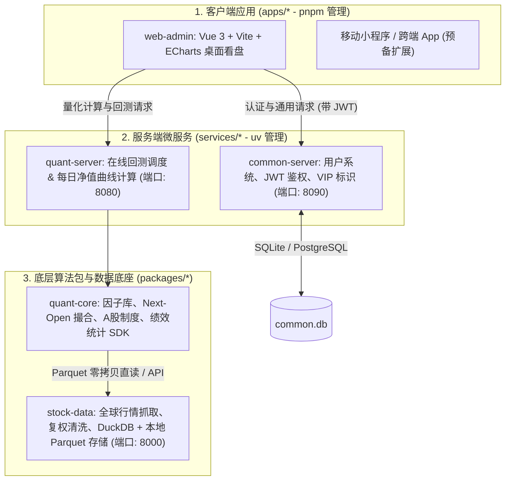

# Global Quant System (全栈量化工程 Monorepo)

基于现代现代化工具链打造的 **Polyglot Monorepo（多语言统一工作区）** 全栈量化投研与执行系统。  
系统涵盖：**全球数据中台 (`stock-data`)**、**量化投研内核与通用因子库 (`quant-core`)**、**控制面 API 服务 (`quant-server`)** 以及 **前端/移动跨端看盘看板 (`web-admin`)**。

---

## 架构拓扑图



---

## 模块结构清单

| 顶层分类 | 模块路径 | 技术栈 | 核心定位与职责 |
| :--- | :--- | :--- | :--- |
| **客户端应用 (`apps/`)** | **`apps/web-admin`** | Vue 3 / Vite / TypeScript / ECharts | 桌面端量化投资看盘看板：回测可视化、收益曲线绘制与策略调优。 |
| **服务端服务 (`services/`)** | **`services/common-server`** | Python / FastAPI / SQLAlchemy 异步 / SQLite | **通用微服务中枢**：负责用户中心、密码加盐加密、JWT 鉴权、VIP 权限守卫。 |
| **服务端服务 (`services/`)** | **`services/quant-server`** | Python / FastAPI / Uvicorn | **量化计算中枢**：对外暴露在线策略回测、参数 Schema 自描述元数据接口。 |
| **底层共享包 (`packages/`)** | **`packages/quant-core`** | Python / Polars / NumPy / Pydantic | **量化算法内核 SDK**：内置技术指标因子库、模拟交易所撮合、A股制度与绩效报表。 |
| **底层共享包 (`packages/`)** | **`packages/stock-data`** | Python / DuckDB / Polars / FastAPI | **全球数据底座**：行情采集、除权分拆折算因子计算、毫秒级 Parquet 存储网关。 |

---

## 快速上手与本地开发

本项目采用 **Python `uv workspace`** 与 **前端 `pnpm workspace`** 双工作区治理。

### 1. 环境准备
确保机器已安装 `uv`（推荐）和 `pnpm`：
```bash
# 安装依赖并一键建立全工作区本地软链接
uv sync --all-packages
```

### 2. 运行命令行离线回测
无需启动任何服务，直接在终端回测内置基准策略：
```bash
# 运行双均线趋势策略 (MA5 / MA20) 回测沪深 300 ETF
uv run python run_backtest.py --symbol 510300.SH.ETF --strategy ma --start 2022-01-01 --end 2024-01-01

# 运行红利低波动态估值定投策略
uv run python run_backtest.py --symbol 512890.SH.ETF --strategy dividend
```

### 3. 分模块本地开发启动 (毫秒级热重载)
你在 `packages/quant-core` 中修改任何因子或撮合代码，所有上层服务都会自动热生效：
```bash
# 终端 1: 启动底层数据中台 (端口: 8000)
pnpm dev:data
# 访问: http://localhost:8000/docs

# 终端 2: 启动量化服务中枢 (端口: 8080)
pnpm dev:server
# 访问: http://localhost:8080/docs
```

### 4. 运行单元测试
```bash
# 运行量化内核全部单测 (撮合规则、T+1、因子计算、回测指标)
pnpm test:core

# 运行数据中台离线单测
pnpm test:data
```

### 5. Docker Compose 全栈容器化启动
```bash
docker compose up -d --build
```
自动拉起 `stock-data-service` 与 `quant-server-service` 并配置容器间内网直通。

---

## 深入文档指南

* 📐 **[系统架构设计规范 (docs/architecture.md)](docs/architecture.md)**：深入了解三层架构解耦、交易流水线、无未来函数撮合设计与跨端 (Vue/Swift) 对接协议。
* 🛠️ **[开发与贡献手册 (docs/dev-guide.md)](docs/dev-guide.md)**：如何编写新因子、如何开发新策略、如何新增 API 接口。
