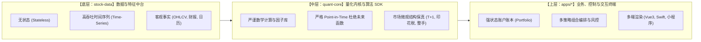
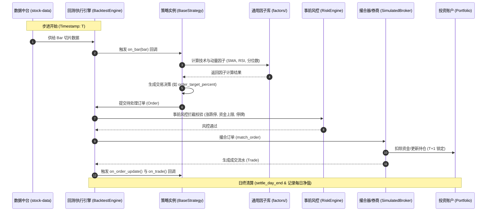

# 系统架构设计规范 (System Architecture Specification)

本文档定义了本量化工程系统的核心设计哲学、全链路流水线、撮合与风控规范，以及未来扩展前端（Vue）、移动原生端（Swift）和小程序的技术契约。

---

## 一、 总体设计哲学与分层边界

在量化工程中，**“边界清晰”决定了系统是能够跑 5 年依然稳定扩展，还是在半年后沦为难以维护的泥潭**。



### 1. 数据中台 (`stock-data`) 守则
* **绝对无状态**：数据服务只负责清洗并供给数据，不知道也不关心资金是谁的。
* **绝不包含任何主观交易策略**：哪怕是双均线金叉，也属于交易策略，不能写在数据层。数据层输出的是客观事实（如 `MA20=15.3`，而不是“建议买入”）。

### 2. 量化内核 (`quant-core`) 守则
* **Code Once, Run Anywhere**：策略派生自 `BaseStrategy`，无论在历史回测、盘中模拟盘还是实盘交易中，核心策略业务代码 100% 零修改。
* **零前视偏差 (No Look-ahead Bias)**：任何指标计算与订单触发严格依据已发生的历史切片。
* **真实摩擦成本**：不考虑滑点、印花税和交易佣金的回测都是“纸上富贵”。内核内置 A 股特有的印花税（卖出万五）、佣金（万2.5最低5元起）、买入整手限制以及 T+1 锁定。

### 3. 应用服务与看板 (`apps/*`) 守则
* **API First / Schema First**：后端以 FastAPI + Pydantic 为核心，输出标准 OpenAPI 文档，成为 Web、iOS App、小程序的唯一信任源（Single Source of Truth）。

---

## 二、 核心交易执行流水线 (Execution Pipeline)



---

## 三、 撮合与时序规范 (Order Matching & No-Lookahead)

### 1. 杜绝日线未来函数的成交机制
在日线回测中，当策略在 `on_bar` 收到当日的 `close` 时，交易所实际已闭市。
* **市价单 (Market Order)**：次日开盘价成交（Next Open）或集合竞价；
* **限价单 (Limit Order)**：必须满足 `low <= limit_price <= high`，否则挂单等待，直到后续 Bar 满足成交条件或超时撤单。

### 2. 滑点与交易成本模型
真实交易中，买入成交价必然上浮，卖出成交价必然下浮：
$$\text{Exec Price (Buy)} = P_{\text{market}} \times (1 + \text{Slippage})$$
$$\text{Exec Price (Sell)} = P_{\text{market}} \times (1 - \text{Slippage})$$
* **佣金**：按成交额双向收取，默认万 2.5，最低 5 元起征；
* **印花税**：A 股仅在股票卖出时单向收取万 5（ETF 与指数免征）；
* **滑点成本**直接体现在成交价格（`exec_price`）中，在账户与持仓扣除时避免重复叠加。

### 3. A 股 T+1 交易制度结算模型
* 当日买入的股票：`quantity += trade_qty`，但 `available_quantity` 不增加（T+1 锁定）；
* 当日结束（`is_day_end`）：调用 `pos.settle_day_end()`，将 `available_quantity = quantity`，次日即可自由卖出。

---

## 四、 多语言与多端扩展方案 (Polyglot Architecture)

本项目为全栈多端做好了完整的架构准备：

```text
quant-system/
├── packages/openapi-spec/         # 由 FastAPI 自动导出的 OpenAPI JSON 与 TypeScript / Swift 类型定义
└── apps/
    ├── quant-server/              # [Python] 后端 API 网关
    ├── web-admin/                 # [Vue 3 + Vite + ECharts] 桌面看盘看板
    ├── mini-program/              # [Uni-app] 微信小程序 (调仓微信通知、轻量监控)
    └── ios-app/                   # [SwiftUI] iOS 原生 App (毫秒级行情流、锁屏 Widget)
```

### 1. 前后端 API 契约自动化 (OpenAPI $\rightarrow$ TypeScript)
后端使用 Pydantic 强类型定义 Request 和 Response。前端 Vue 3 工程无需手写 API 请求接口：
```bash
# 一键从后端 FastAPI 自动生成强类型 TypeScript 客户端
npx openapi-typescript http://localhost:8080/openapi.json -o apps/web-admin/src/api/schema.ts
```
一旦后端字段发生改动，前端在本地编译期即可精准报错提示，彻底消除跨团队联调扯皮。

### 2. 移动端 (Swift / iOS) 的接入
* 利用苹果官方的 **Swift OpenAPI Generator**，直接把后端的 OpenAPI spec 转成 Swift 强类型异步网络请求（`async/await`）；
* 结合 iOS 锁屏小组件（WidgetKit），实时展示当前策略组合的今日收益率与最大回撤。
